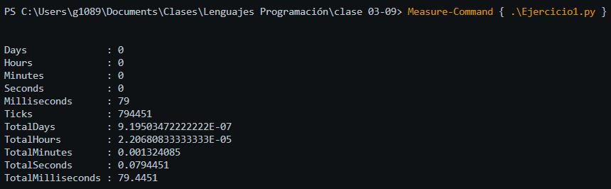

# Notas de Clase 03/09/2026
Los lenguajes de programación se dividen en dos grandes categorias compilados e interpretados

La diferencia clave esta en el momento y la forma en que ese codigo se traduce a lenguaje de maquina el único lenguaje que el hardware puede ejecutar directamente.

## Lenguajes Compilados
Ventajas de lenguajes compilados
En un lenguaje compilador el código fuente se traduce a código de maquina una sola vez antes de ejecutarse. A este proceso se le llama compilación
Son lenguajes que usualmente están programados par aun hardware especifico.
Ventajas
- Velocidad
- Eficiente
Deventajas
- Tiempo de compilación
- Portabilidad

## Lenguajes Interepretados
En un lenguaje interpretado, el codigo fuente se traduce a codigo de maquina en tiempo de ejecucion: el programa se traduce cada vez que corre
Ventajas
- Rapidez de desarrollo
- Protabilidad
Deventajas
- Velocidad
- Eficencia

Lenguajes de Zona intermedia: bytecode y compilación JIT
La frontera entre compilado e interpretado no siempre es tan clara. Muchos lenguajes actuales combinan ambas ideas en dos etapas:
Codigo fuente -> compilacion a byteccode -> maquina virtual+jit


`Ej:Java, python, c#`

# Actividade en Clase
Realizar una tabla comparativa que muestre en la practica, las diferencias entre un lenguaje Interpretado *(python)* y un lenguaje Compilado *(C++)*.

```
📁 clase 03-09/
│
├── 📁 src/                     # Código fuente
│   ├── 📁 ejercicio1/
│   │   ├── ejercicio1.cpp
│   │   └── Ejercicio1.py
│   ├── 📁 ejercicio2/
│   │   ├── ejercicio2.cpp
│   │   └── Ejercicio2.py
│   └── 📁 ejercicio3/
│       ├── ejercicio3.cpp
│       └── Ejercicio3.py
│    
├── 📁 bin/                     # Ejecutables compilados
│   ├── ejercicio1.exe
│   ├── ejercicio2.exe
│   ├── ejercicio3.exe
│   └── main.exe
│
├── 📁 scripts/                 # Scripts de Ejemplo
│   ├── compilacion-python.py
|   ├── main.cpp
|   └── main.exe
│
│
├── 📁 capturas/                # Capturas de pantalla
│   └── *.png  (13 archivos)
│
└── README.md
``` 

## Ejercicio 1
Generar 10 valores aleatorios. Presentar la suma y el promedio.

### Python
```python
# Ejercicio1.py
import random as rd
valores = 0
for i in range(10):
    valores += rd.randint(1, 100)

print(valores)
print(valores/10)
```

### C++
```c++
// Ejercicio1.cpp
#include <iostream>
#include <cstdlib>
#include <ctime>

using namespace std;

int main() {
    int valores = 0;
    srand(time(0));

    for (int i = 0; i < 10; i++) {
        valores += rand() % 100 + 1;
    }

    cout << valores << endl;
    cout << static_cast<double>(valores) / 10 << endl;

    return 0;
} 
```


| Métrica | C++ | Python |
|---|---|---|
| **Compilación** | 4,698.69 ms | No aplica |
| **Ejecución 1 (sin caché)** | 395.56 ms | 79.45 ms |
| **Ejecución 2 (con caché)** | 15.93 ms | ~79.45 ms* |

## Ejercicio 2
Generar 500 valores aleatorios entre 50 y 100. Presentar cuántos son pares y cúantos impares
### Python
```python
# Ejercicio2.py
import random as rd
valores = []
for i in range(500):
    valores.append(rd.randint(50,100))

valoresPares = []
valoresImpares = []

for i in valores:
    if i%2 == 0:
        valoresPares.append(i)
    else:
        valoresImpares.append(i)
        
print("Valores Pares")
print(valoresPares)
print("Valores Impares")
print(valoresImpares)
```


### C++
```c++
// ejercicio2.cpp
#include <iostream>
#include <vector>
#include <cstdlib>
#include <ctime>

using namespace std;

int main() {
    vector<int> valores;
    srand(time(0));

    for (int i = 0; i < 500; i++) {
        valores.push_back(rand() % 51 + 50);
    }

    vector<int> valoresPares;
    vector<int> valoresImpares;

    for (int val : valores) {
        if (val % 2 == 0) {
            valoresPares.push_back(val);
        } else {
            valoresImpares.push_back(val);
        }
    }

    cout << "Valores Pares:" << endl;
    for (int val : valoresPares) {
        cout << val << " ";
    }
    cout << endl << endl;

    cout << "Valores Impares:" << endl;
    for (int val : valoresImpares) {
        cout << val << " ";
    }
    cout << endl;

    return 0;
} 
```


| Métrica | C++ | Python |
|---|---|---|
| **Compilación** | 742.39 ms | No aplica |
| **Ejecución 1 (sin caché)** | 93.62 ms | 58.96 ms |
| **Ejecución 2 (con caché)** | 13.75 ms | ~58.96 ms* |
## Ejercicio 3
Generar 2 arreglos paralelos con las 25 sucursales de una empresa y sus ventas. Presentar el promedio de ventas y las suscursales por encima del promedio.
### Python
```python
#Ejercicio 3.py
import random
sucursales = [i for i in range(1, 26)]
ventas = [random.randint(100, 5000) for x in range(25)]

print("Sucursales:", sucursales)
print("Ventas:", ventas)

ventasTotalesPromedio = sum(ventas)/len(ventas)
print("Ventas totales promedio:", ventasTotalesPromedio)

for i in ventas:
    if i > ventasTotalesPromedio:
        print(i)
 ```
 
### C++
```c++
//ejercicio 3.cpp
#include <iostream>
#include <vector>
#include <cstdlib>
#include <ctime>

using namespace std;

int main() {
    vector<int> sucursales(25);
    vector<int> ventas(25);
    srand(time(0));

    for (int i = 0; i < 25; i++) {
        sucursales[i] = i + 1;
        ventas[i] = rand() % 4901 + 100;
    }

    cout << "Sucursales: ";
    for (int s : sucursales) {
        cout << s << " ";
    }
    cout << endl;

    cout << "Ventas: ";
    for (int v : ventas) {
        cout << v << " ";
    }
    cout << endl;

    double suma = 0;
    for (int v : ventas) {
        suma += v;
    }
    double ventasTotalesPromedio = suma / ventas.size();

    cout << "Ventas totales promedio: " << ventasTotalesPromedio << endl;

    cout << "Ventas mayores al promedio:" << endl;
    for (int v : ventas) {
        if (v > ventasTotalesPromedio) {
            cout << v << " ";
        }
    }
    cout << endl;

    return 0;
}
 ```
| Métrica | C++ | Python |
|---|---|---|
| **Compilación** | 584.48 ms | No aplica |
| **Ejecución 1 (sin caché)** | 93.39 ms | 72.30 ms |
| **Ejecución 2 (con caché)** | 14.13 ms | ~72.30 ms* |


